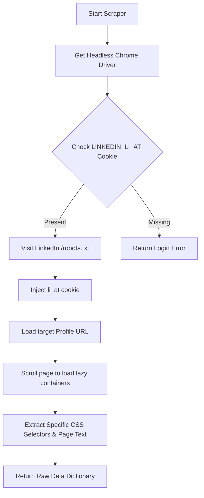
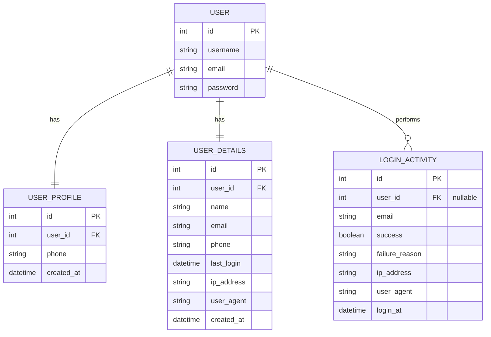

# Django LinkedIn Automation & Chatbot Registration Assistant

This documentation provides a comprehensive overview of the **Django LinkedIn Automation & Chatbot Registration Assistant** project. The application features a conversational registration chatbot, automated LinkedIn profile scraping using Selenium, structured AI extraction using Gemini API, email password reset flows, and audit tracking for login activities.

---

## Table of Contents
1. [Project Overview](#1-project-overview)
2. [Directory Structure](#2-directory-structure)
3. [Architecture & System Flow](#3-architecture--system-flow)
   - [A. Chatbot Registration Flow](#a-chatbot-registration-flow)
   - [B. Web Scraping & Selenium Pipeline](#b-web-scraping--selenium-pipeline)
   - [C. Gemini AI Integration](#c-gemini-ai-integration)
   - [D. Login Auditing System](#d-login-auditing-system)
4. [Database Models & Schema](#4-database-models--schema)
5. [Environment Variables Config](#5-environment-variables-config)
6. [Installation & Setup](#6-installation--setup)
7. [API Endpoints Reference](#7-api-endpoints-reference)
8. [Testing & Verification](#8-testing--verification)

---

## 1. Project Overview

The project is built on **Django 5.0.14** and leverages modern AI and web scraping technologies:
- **Conversational UI**: A custom-designed chatbot interfaces with the user to collect registration info (instead of static forms).
- **Selenium Scraping (`undetected-chromedriver`)**: Automatically logs into LinkedIn using a session cookie and extracts raw text data from public or private profiles.
- **Gemini AI Parsing (`gemini-2.5-flash`)**: Parses unstructured LinkedIn page texts into highly structured JSON formats (Name, Headline, Experience, Education, and Skills).
- **Multi-Database Support**: Dynamically switches between SQLite (for local debugging) and MySQL/PyMySQL (for production) using environment variables.

---

## 2. Directory Structure

```text
linkdin_link_automation/
│
├── chatbot_project/            # Django main project configuration
│   ├── __init__.py
│   ├── asgi.py
│   ├── settings.py             # App configurations, database connections, SMTP setups
│   ├── urls.py                 # Core routing configuration
│   └── wsgi.py
│
├── accounts/                   # Primary Django application
│   ├── admin.py                # Django Admin dashboard registrations
│   ├── apps.py                 # App config metadata
│   ├── linkedin_scraper.py     # LinkedIn scraping (Selenium) & Gemini parser logic
│   ├── models.py               # Custom User, Profile, UserDetails, and LoginActivity models
│   ├── tests.py                # Comprehensive backend unit tests
│   ├── urls.py                 # Endpoint routing for accounts and APIs
│   ├── views.py                # View handlers for registration, scraping, login, reset-password
│   │
│   └── templates/accounts/     # HTML templates for visual interfaces
│       ├── chatbot.html        # Chatbot registration flow interface
│       ├── home.html           # Post-registration welcome page
│       ├── password_reset_complete.html # Confirmation page for password resets
│       ├── password_reset_confirm.html  # Verification forms for password resets
│       └── user_details.html   # Admin user database list & statistics view
│
├── .env.example                # Sample environment configuration template
├── .gitignore                  # Git untracked pattern definitions
├── db.sqlite3                  # Local SQLite database (when DJANGO_USE_SQLITE=True)
├── manage.py                   # Django CLI utility entry point
├── requirements.txt            # Python environment packages listing
└── run_migrations.py           # Migration helper script
```

---

## 3. Architecture & System Flow

### A. Chatbot Registration Flow

Unlike traditional registration pages, users are welcomed by a clean, responsive chatbot page.
1. **Initiation**: The chatbot asks for a LinkedIn Profile URL.
2. **Auto-Fill Check**: The URL is sent to the backend `/api/linkedin-scrape/` to scrape and parse details.
   - **If successful**: The extracted `Name` is auto-filled, and the chatbot transitions directly to Step 2 (Email).
   - **If unsuccessful (Fallback)**: The chatbot gracefully alerts the user and asks them to type their `Name` manually, proceeding with normal steps.
3. **Sequential Steps**: The bot prompts for:
   - **Step 1**: Name (auto-filled or manual)
   - **Step 2**: Email ID
   - **Step 3**: Mobile number (10 to 15 digits)
   - **Step 4**: Password (minimum 8 characters with validations)
   - **Step 5**: Confirm Password
4. **Registration Submission**: Data is POSTed to `/api/register/`. If successful, the user is redirected to `/home/`.

---

### B. Web Scraping & Selenium Pipeline

Implemented inside `accounts/linkedin_scraper.py`, the scraper bypasses Cloudflare/bot detectors using **`undetected-chromedriver`**.



- **Authentication**: Avoids password credential issues by using the `li_at` cookie value, mimicking an active authenticated session.
- **Resilience**: The script falls back to parsing the raw body text (`page_text`) up to 12,000 characters if specific class selectors change.

---

### C. Gemini AI Integration

Scraped LinkedIn raw text is usually messy. The `parse_with_gemini` helper calls the **Gemini API** (`gemini-2.5-flash`) with a custom prompt to clean, organize, and structure the content.

```python
model = genai.GenerativeModel("gemini-2.5-flash")
```

The system sends a detailed system prompt instructing the model to return **only** a valid JSON object matching this schema:
```json
{
  "name": "Full name",
  "headline": "Job title or professional headline",
  "location": "City, Country",
  "about": "About/Summary text",
  "experience": [
    {
      "title": "Job title",
      "company": "Company name",
      "duration": "Date range",
      "description": "Role description"
    }
  ],
  "education": [
    {
      "degree": "Degree or course name",
      "school": "University or school name",
      "year": "Year or duration"
    }
  ],
  "skills": ["Skill 1", "Skill 2"]
}
```

---

### D. Login Auditing System

Every login attempt goes through audit logging inside `accounts/views.py`:
- Captures client IP using the `HTTP_X_FORWARDED_FOR` header (with a fallback to `REMOTE_ADDR`).
- Captures the exact User-Agent string from browser request metadata.
- Appends a status record to the `LoginActivity` database table for both successful and failed logins.

---

## 4. Database Models & Schema

The application defines 4 primary models in `accounts/models.py`:



### 1. `User` (Custom User Model)
*Inherits from Django's `AbstractUser`.*
- Normalizes email and username to lowercase on save to avoid duplicates.

### 2. `UserProfile`
- Links a user to their phone number.
- `phone`: CharField (max 15 chars, unique).

### 3. `UserDetails`
- Keeps registration audit logs.
- Stores custom data like client IP and user agent.
- Automatically updated on registration or subsequent login.

### 4. `LoginActivity`
- Keeps historical audit records of all login activities.
- `success`: Boolean showing whether the credentials matched.
- `failure_reason`: Reason for failures (e.g. `"Invalid email or password"`).

---

## 5. Environment Variables Config

Configure a `.env` file in the root directory:

| Variable | Description | Example |
| :--- | :--- | :--- |
| `DJANGO_SECRET_KEY` | Secret security string for Django encryption. | `django-insecure-key-goes-here` |
| `DJANGO_DEBUG` | Enable debug logs (`True` or `False`). | `True` |
| `DJANGO_ALLOWED_HOSTS` | Hosts allowed to serve the app. | `localhost,127.0.0.1` |
| `DJANGO_USE_SQLITE` | Set `True` to bypass MySQL and use SQLite instead. | `False` |
| `SQLITE_DATABASE` | File path for SQLite db file (if use sqlite). | `db.sqlite3` |
| `MYSQL_DATABASE` | Name of the target MySQL database. | `linkdin_automation` |
| `MYSQL_USER` | MySQL database user. | `root` |
| `MYSQL_PASSWORD` | MySQL database user password. | `password123` |
| `MYSQL_HOST` | Host address of the MySQL instance. | `localhost` |
| `MYSQL_PORT` | Port of the MySQL instance. | `3306` |
| `EMAIL_HOST` | SMTP server host for password reset mail. | `smtp.gmail.com` |
| `EMAIL_PORT` | SMTP port. | `587` |
| `EMAIL_USE_TLS` | SMTP TLS encryption enable. | `True` |
| `EMAIL_HOST_USER` | Email account used to send automated messages. | `your_email@gmail.com` |
| `EMAIL_HOST_PASSWORD` | App password generated from email provider. | `xxxx xxxx xxxx xxxx` |
| `APP_BASE_URL` | Base URL used to build reset password links. | `http://127.0.0.1:8000` |
| `LINKEDIN_LI_AT` | LinkedIn active session cookie value. | *Long Cookie Value* |
| `GEMINI_API_KEY` | Google Generative AI API Token. | `AIzaSy...` |

---

## 6. Installation & Setup

Follow these commands to deploy the application locally:

### Step 1: Install Dependencies
Ensure you have Python 3.10+ installed. Run:
```bash
pip install -r requirements.txt
```
*(Make sure Chrome is installed on the local system for Selenium scraping).*

### Step 2: Initialize Database
- **For MySQL**: Create the schema first:
  ```sql
  CREATE DATABASE linkdin_automation CHARACTER SET utf8mb4 COLLATE utf8mb4_unicode_ci;
  ```
- **For SQLite (Quick Start)**: Set the environment variable:
  - **PowerShell**: `$env:DJANGO_USE_SQLITE="True"`
  - **Command Prompt**: `set DJANGO_USE_SQLITE=True`
  - **Linux/macOS**: `export DJANGO_USE_SQLITE=True`

### Step 3: Run Database Migrations
Generate and run Django migrations:
```bash
python manage.py makemigrations
python manage.py migrate
```

### Step 4: Create Superuser
Make an admin login to access `/admin/` and `/user-details/` views:
```bash
python manage.py createsuperuser
```

### Step 5: Start Development Server
Run:
```bash
python manage.py runserver
```
Visit http://127.0.0.1:8000/ to view the Registration Chatbot!

---

## 7. API Endpoints Reference

### 1. Register Chatbot User
- **Endpoint**: `POST /api/register/`
- **Request Body**:
  ```json
  {
    "name": "Dhruv Patel",
    "phone": "9876543210",
    "email": "dhruv@example.com",
    "password": "StrongPassword123!",
    "confirm_password": "StrongPassword123!"
  }
  ```
- **Response (Success - 201 Created)**:
  ```json
  {
    "success": true,
    "message": "Registration complete thai gayu. Tamari details save thai gai che.",
    "redirect_url": "/home/"
  }
  ```
- **Response (User Already Exists - 409 Conflict)**:
  ```json
  {
    "success": false,
    "message": "User is already exist.",
    "errors": {
      "email": "User is already exist.",
      "phone": "User is already exist."
    }
  }
  ```

---

### 2. Login Chatbot User
- **Endpoint**: `POST /api/login/`
- **Request Body**:
  ```json
  {
    "email": "dhruv@example.com",
    "password": "StrongPassword123!"
  }
  ```
- **Response (Success - 200 OK)**:
  ```json
  {
    "success": true,
    "message": "Login successful. Tamari login entry database ma save thai gai che.",
    "redirect_url": "/home/",
    "user": {
      "id": 1,
      "name": "Dhruv Patel",
      "email": "dhruv@example.com"
    }
  }
  ```

---

### 3. Trigger LinkedIn Profile Scraping
- **Endpoint**: `POST /api/linkedin-scrape/`
- **Request Body**:
  ```json
  {
    "url": "https://www.linkedin.com/in/some-profile-username/"
  }
  ```
- **Response (Success - 200 OK)**:
  ```json
  {
    "success": true,
    "profile": {
      "name": "Scraped Name",
      "headline": "Software Engineer at Google",
      "location": "Bengaluru, India",
      "about": "Scraped about summary...",
      "experience": [...],
      "education": [...],
      "skills": ["Python", "Django", "AI"],
      "url": "https://www.linkedin.com/in/some-profile-username/"
    }
  }
  ```

---

### 4. Forgot Password Email Verification
- **Endpoint**: `POST /api/forgot-password/`
- **Request Body**:
  ```json
  {
    "email": "dhruv@example.com"
  }
  ```
- **Response (Success - 200 OK)**:
  ```json
  {
    "success": true,
    "message": "Password reset link tamara email par mokli didhi che."
  }
  ```

---

## 8. Testing & Verification

The suite covers API input validation, auth flows, unique constraint checks, and database session operations.

### Running Django Unit Tests:
Run the tests using the command line:
```bash
python manage.py test
```

### Key Scenarios Tested in `accounts/tests.py`:
1. **`test_register_user_from_chatbot`**: Verifies successful registration, password hashing verification, and creation of matching profiles.
2. **`test_duplicate_phone_is_rejected`**: Validates that double entries with the same mobile number return a `409 Conflict` error block.
3. **`test_duplicate_email_is_rejected_as_existing_user`**: Verifies duplicates of active email addresses fail validation.
4. **`test_login_user_creates_login_activity`**: Validates a correct password writes a successful audit row into the `LoginActivity` table.
5. **`test_invalid_login_creates_failed_activity`**: Validates incorrect credentials log a failed session audit trail.
6. **`test_forgot_password_sends_reset_email`**: Evaluates that triggers build and send emails using mock email servers.
